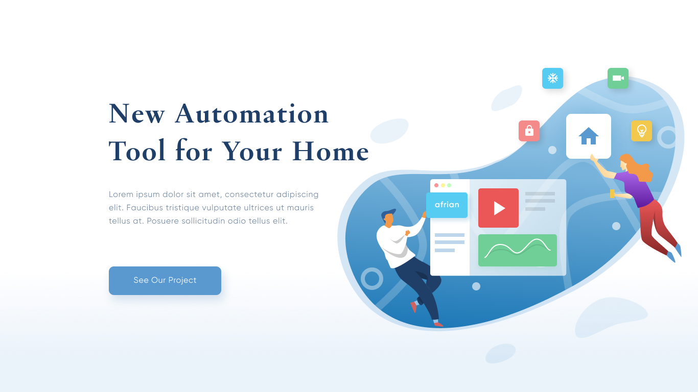

# Afrikansa Project

The purpose if this project is to build a landing page working as a team.

## Design

We use this [Design](https://www.figma.com/file/vRMJVq9Byaw7lHp9O5Dzlz/afrianska-landingpage?node-id=0%3A1).

## Install dependencies

You should run this command to install all the libraries used in the project.

```bash
npm install
```

## Start the project

Use the package manager [npm](https://www.npmjs.com/) to start.

```bash
npm start
```

You should be able to run your project in the port [8080](http://localhost:8080/)

## Sections




